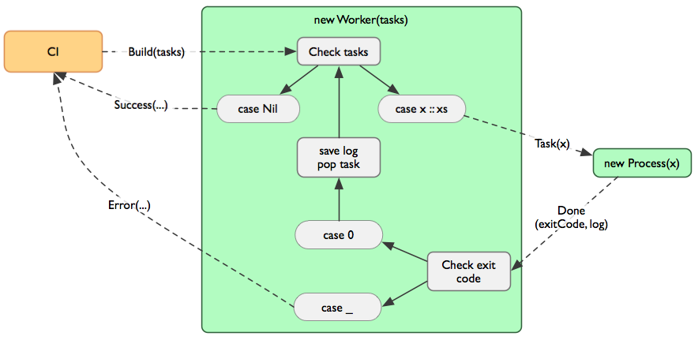

## General information

The aim of this module is to provide stable continous integration server for multiple projects. The basic concept is to have a single instance of `Server` that spawns `Worker`s on demand. 
First version will only support git version control system and builds that use simple-build-tool. 

## Requirements
* git library (com.verknowsys.served.utils.git)
* notifications (com.verknowsys.served.notifications)
* proccess (com.verknowsys.served.systemmanager)
* persistant storage

## Configuration
For every registered project there must be:

* project name
* git repository url
* git branch that will be built
* subdirectory path (optional)
* list of sbt tasks to run (possible commands will include: clean, update, test, project %name%)
* notification configuration
* JDK version select

## Build path

### Manually requested build
* `Server` receives `Build(projectName)` message
  * Check for project existence
* `Worker` instance linked with project is spawned
* If this is first build clone repository using provided git url (**TODO: Where to clone?**)
* `git pull origin %branch%` changes
* Execute all tasks provided by project's configuration
* If one command fails (returns non-zero exit status) stop executing tasks
* Save information about executed (or not) tasks, is't exit code and output
* Notify `Server` about finished build passing all informations
* `Server` updates build information in database and send message to `NotificationCenter` that will notify all interested

### Build requested by code update
* Just send `Build(projectName)` to `Server`, the rest is same as in Manual build

## Important
* `Server` allows parallel builds of *different* projects, but must prevent two workers building one project

## Public API
Message                     | Description               | Parameters                  | Reply
----------------------------|---------------------------|-----------------------------|-------
`Build(name: String)`       | Start building project    | `name` - project name       | none


case class ProjectConfiguration(
    name: String,
    gitRemoteUrl: String,
    gitBranch: String,
    subdirectory: Option[String],
    tasks: List[SbtTask]
)
